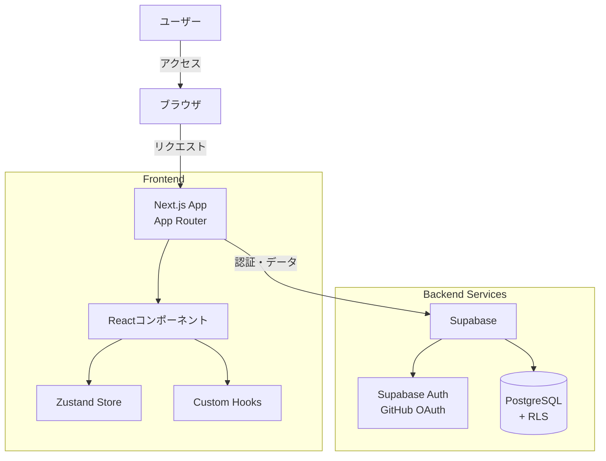
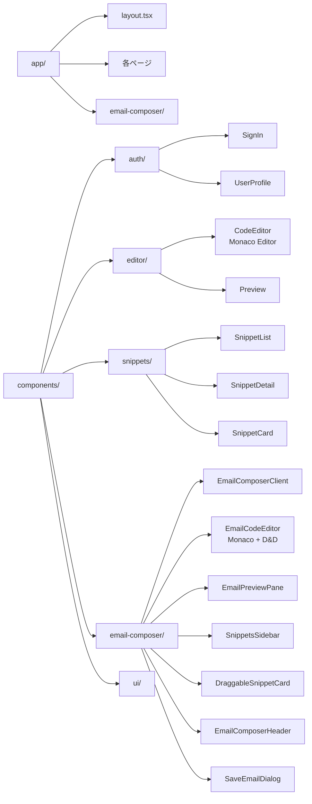
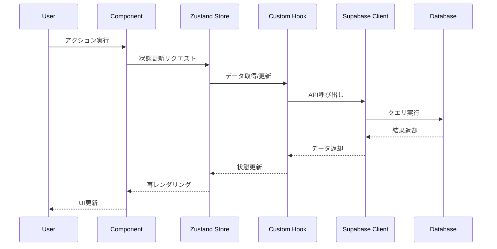
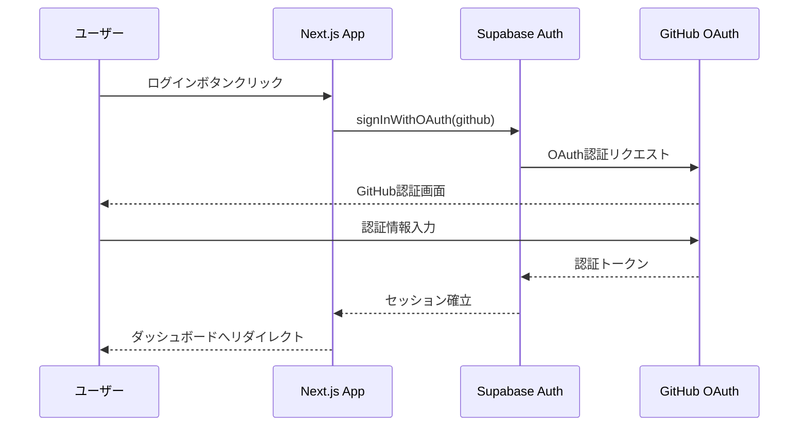
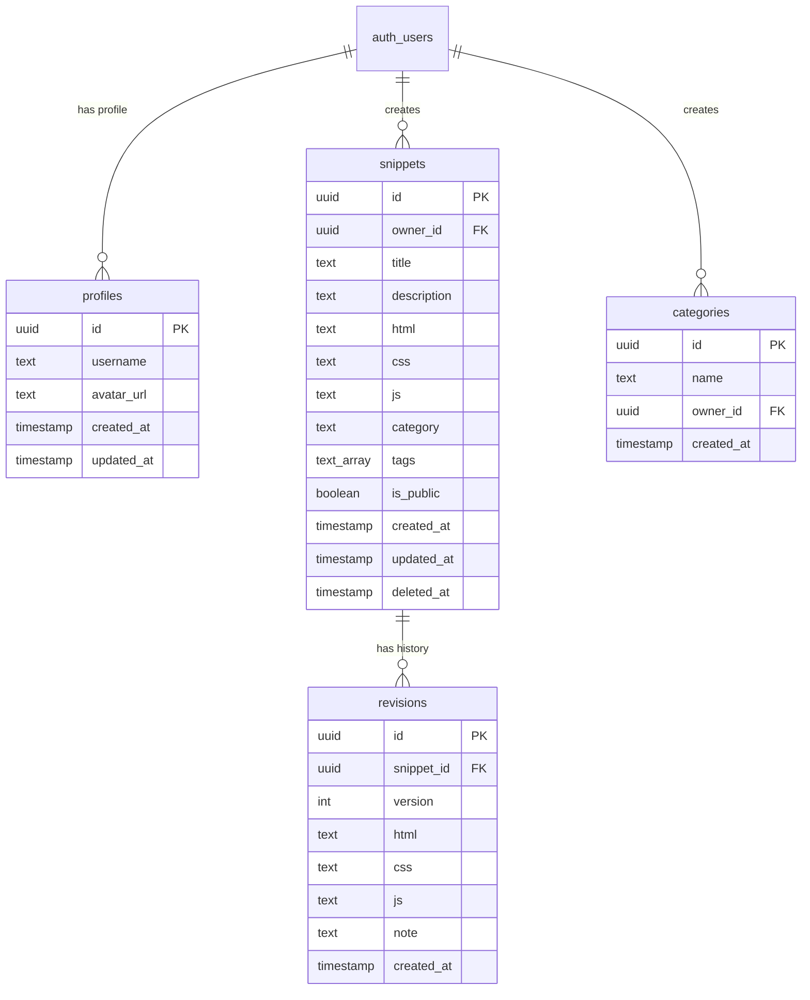
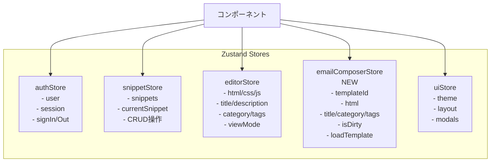
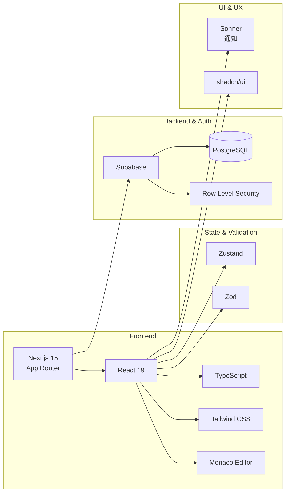
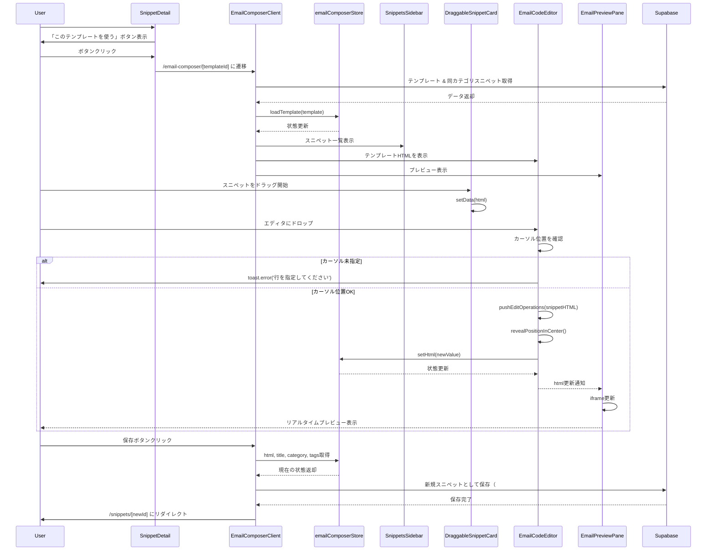
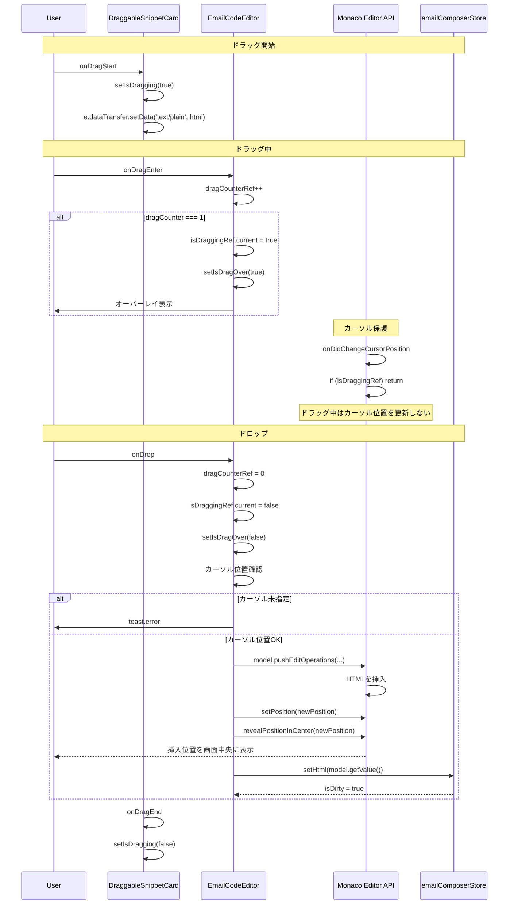
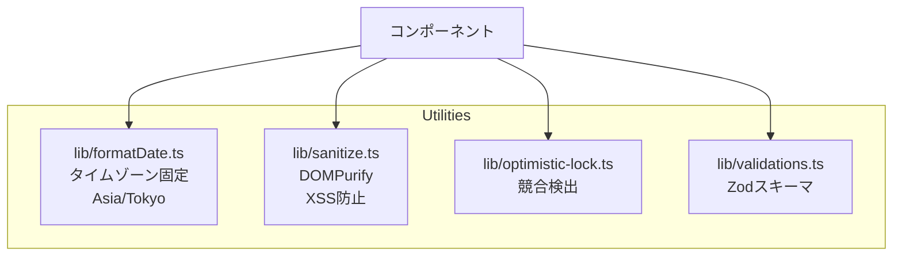

# Snippet Manager アーキテクチャ図

> **📚 関連ドキュメント:**
> - [実装仕様書](./codepen_html.md) - Single Source of Truth（SSOT）
> - [実装状況](./IMPLEMENTATION_STATUS.md) - 実装進捗とリリース判定
> - [実装計画](./implementation_plan.md) - フェーズ別実装計画
> - [メールコンポーザー仕様書](./email-composer-spec.md) - HTMLメール作成機能の詳細仕様
> - [トラブルシューティング](./TROUBLESHOOTING.md) - 問題解決ガイド
> - [プロジェクトREADME](../README.md) - プロジェクト全体概要
> - [監査レポート](./audits/) - コード監査結果

**最終更新**: 2025-11-17
**実装状況**: ✅ 完了（本番環境デプロイ可能）

## システム全体構成

## コンポーネント構造

## データフロー

## 認証フロー

## データベーススキーマ

> **注:** 完全なスキーマ定義とRLSポリシーは [`codepen_html.md`](./codepen_html.md) を参照してください。

## 状態管理構造

## 技術スタック詳細

## HTMLメールコンポーザーのデータフロー

## ドラッグ&ドロップのフロー（詳細）

## ユーティリティライブラリ

## セキュリティ対策

### Hydration Error完全解決
- **問題**: サーバー(UTC)とクライアント(JST)で日付表示が異なり、React Error #418が発生
- **解決**: `lib/formatDate.ts` でタイムゾーンを`Asia/Tokyo`に固定し、サーバー・クライアント双方で同じ結果を保証
- **効果**: `suppressHydrationWarning`不要、根本的に差分が発生しない実装

### XSS対策
- **DOMPurify**: すべてのHTML表示で`sanitizeHTML()`を使用
- **iframe sandbox**: `allow-scripts`のみ許可、`allow-same-origin`は禁止
- **CSP**: Content Security Policyで外部リソースを制限

### 認証・認可
- **Supabase Auth**: GitHub OAuthで認証
- **RLS**: Row Level Securityで権限管理
- **Middleware**: 認証チェックとリダイレクト

## パフォーマンス最適化

### Monaco Editorのドロップ機能
- **ドラッグカウンター方式**: 無限ループを防止
- **pointer-events: none**: オーバーレイのイベント干渉を防止
- **カーソル位置保護**: ドラッグ中の`onDidChangeCursorPosition`を無視
- **自動スクロール**: `revealPositionInCenter()`で挿入位置を表示

### デバウンス処理
- **プレビュー**: 300msデバウンス
- **自動保存**: 3秒デバウンス（エディタ）
- **コードエディタ**: 300msデバウンス（メールコンポーザー）

### React最適化
- **React.memo**: コンポーネントメモ化
- **useMemo/useCallback**: 不要な再計算を防止
- **dynamic import**: Monacoエディタの遅延読み込み

---

## 関連ドキュメント

| ドキュメント | 説明 |
|------------|------|
| [codepen_html.md](./codepen_html.md) | 完全な実装仕様書（SSOT） |
| [email-composer-spec.md](./email-composer-spec.md) | HTMLメールコンポーザーの詳細仕様 |
| [IMPLEMENTATION_STATUS.md](./IMPLEMENTATION_STATUS.md) | 実装進捗とリリース判定 |
| [implementation_plan.md](./implementation_plan.md) | フェーズ別実装計画 |
| [TROUBLESHOOTING.md](./TROUBLESHOOTING.md) | React Error #418、ドロップ機能の解決ガイド |
| [audits/](./audits/) | コード監査レポート一覧 |
| [../README.md](../README.md) | プロジェクト全体概要 |

---

**Last Updated**: 2026-01-17
**Update**: Documentation restructured, links fixed
